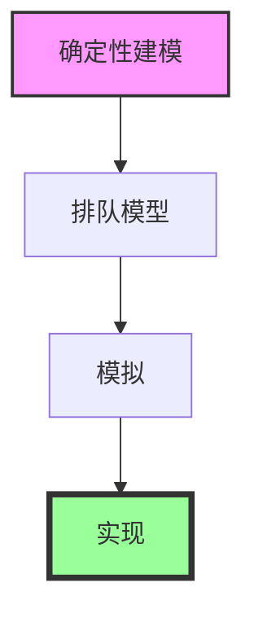

这五张PPT是本书第6章（CPU调度）的收尾部分：**算法评估 (Algorithm Evaluation)**。

之前我们学习了 FCFS、SJF、RR、MLFQ 等算法，那么问题来了：**我们怎么知道哪个算法在实际系统中更好？** 这一节回答了这个问题，介绍了四种评估方法。

---

## 方法一：确定性建模 (Deterministic Modeling) —— 图2

*   **定义**：给定一组**预先确定的**进程信息（到达时间、爆发时间），用数学方式计算出算法的性能指标（等待时间、周转时间等）。
*   **你刚才在PPT里看到的大量计算题（画甘特图、算平均等待时间）**，本质上就是这种方法。
*   **优点**：
    *   **简单**：只用纸笔就能算。
    *   **快速**：不需要写代码或跑系统。
    *   **直观**：能清晰展示算法的逻辑优缺点。
*   **缺点**：
    *   **过于具体**：只针对那一组特定的输入。如果输入变了（比如进程变成 100 个，或者爆发时间变得很长），结果可能完全不同。
    *   **无法泛化**：不能代表真实世界的复杂、随机负载。

---

## 方法二：排队模型 (Queueing Models) —— 图3

*   **定义**：用数学公式（排队论）来描述系统的行为。
    *   把计算机系统看作一个**服务器网络**：CPU 是一个服务器（有就绪队列），I/O 设备也是一个服务器（有设备队列）。
    *   已知**到达率**（新进程来的速度）和**服务率**（CPU处理速度），可以算出：
        *   CPU使用率
        *   平均队列长度
        *   平均等待时间
*   **优点**：
    *   能快速比较不同算法在**宏观负载**下的表现。
    *   不需要运行实际代码。
*   **缺点**：
    *   **现实分布很难用公式精准表达**。真实进程的到达和爆发模式非常复杂，公式只能近似。

---

## 方法三：模拟 (Simulations) —— 图4

*   **定义**：写一个**模拟程序**，模拟计算机系统的运行过程。
    *   用软件数据结构表示CPU、就绪队列、进程。
    *   用一个**时钟变量**驱动模拟前进，每走一步更新系统状态。
    *   最终收集统计指标。
*   **优点**：
    *   **灵活**：可以任意设计进程的到达和爆发模式（比如模拟不同分布，甚至模拟真实系统的工作负载）。
    *   **详细**：能得到非常精细的数据。
*   **缺点**：
    *   **昂贵**：编写一个好的模拟器需要大量编程工作。
    *   **慢**：模拟长时段运行需要消耗计算资源。

---

## 方法四：实现 (Implementation) —— 图5

*   **定义**：直接在**真实操作系统内核**中实现该调度算法，观察真实运行效果。
*   **优点**：
    *   **最真实**：能反映所有硬件和系统软件交互的复杂情况。
*   **缺点**：
    *   **成本极高**：
        *   修改OS内核非常危险（可能导致系统崩溃）。
        *   实现和维护算法复杂。
        *   难以在产线上直接实验。
*   **结论**：这是最后的验证手段，通常只在研究实验室进行。

---

## 💡 总结：四种方法的层级关系

将这四种方法排列，可以清晰地看到“成本与真实性”的权衡：

1.  **确定性建模**：最简单、最快，但最**不真实**（PPT课后作业/考试）。
2.  **排队模型**：数学分析，泛化能力强，但**公式复杂**。
3.  **模拟**：可以模拟各种复杂场景，精度高，但**编程工作量大**。
4.  **实现**：最真实，但**成本高、风险大**。

---

## 📝 关于底部那两行字

PPT 最后写道：
> **A Perfect Scheduling Algorithm Is Not Easy To Found.**
> **In Practice, We Don't Really Need The Perfect Scheduling Algorithm.**

这句话总结了本章的核心哲学：

*   **不存在完美的调度算法**。因为不同场景的目标不同（有的要吞吐量，有的要响应速度，有的要公平）。
*   **在实际工程中，我们只需要“足够好”的算法**。比如 Linux 的 CFS（完全公平调度器）和 Windows 的调度器，它们都不是理论最优的，但它们在实际负载下表现得非常好。

如果你理解了这一章的内容，你就掌握了操作系统中最核心的决策机制。这是计算机系统设计的基础，也是理解多线程、并发和性能调优的起点。