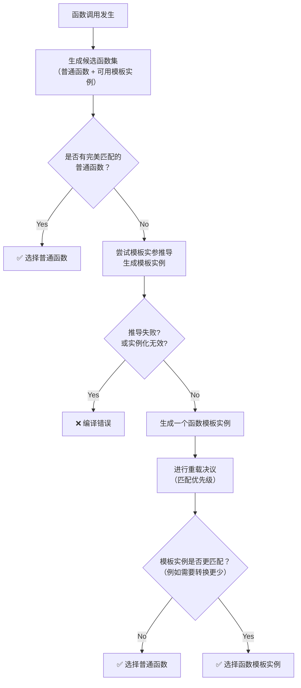

好的，我们来详细讲解一下C++中普通函数和函数模板的调用规则。这是一个关于C++重载决议（Overload Resolution）的核心话题。

编译器在遇到一个函数调用时，会按照一套非常精密且确定的规则来选择最终要调用的函数。理解这些规则对于编写可预测、高效的代码至关重要。

### 核心调用规则总览

当调用点同时匹配一个普通函数和一个函数模板时，编译器的选择遵循一个基本的优先级原则，并涉及模板实参推导（Template Argument Deduction）和模板特化（Template Specialization）。

简单来说，其决策过程可以概括为以下流程图，它展示了编译器如何在一系列候选函数中做出选择：



上图是简化的核心逻辑，下面的文字部分我们将深入探讨每个环节的细节。

---

### 1. 模板实参推导 (Template Argument Deduction)

这是整个过程的第一步。编译器会尝试根据调用时提供的实参，来推导出函数模板的类型参数（如 `T`）。只有当推导成功时，这个函数模板实例才会成为候选函数。

*   **推导成功**：编译器生成一个具体的函数实例，加入候选集。
*   **推导失败**：该模板被从候选集中移除，不会报错（这是SFINAE概念的基础）。

**示例：**
```cpp
template<typename T>
void foo(T a) { } // 模板

void foo(int a) { } // 普通函数

int main() {
    foo(42);    // 推导成功：T -> int, 生成 void foo(int)
    foo("hello"); // 推导成功：T -> const char*, 生成 void foo(const char*)
}
```

### 2. 重载决议的优先顺序

当候选集中同时存在普通函数和模板函数实例时，编译器按照以下顺序优先选择：

#### **规则一：优先选择普通函数，而非模板实例**

如果有一个普通函数和一个模板实例**完全匹配**参数类型（不需要任何隐式类型转换），那么编译器会毫不犹豫地选择普通函数。

**示例：**
```cpp
#include <iostream>
using namespace std;

// 模板
template<typename T>
void myPrint(T a) {
    cout << "模板函数: " << a << endl;
}

// 普通函数
void myPrint(int a) {
    cout << "普通函数: " << a << endl;
}

int main() {
    myPrint(10); // 输出：普通函数: 10
                 // 参数是int，与普通函数完全匹配，故选择普通函数
                 
    myPrint(10.5); // 输出：模板函数: 10.5
                   // 参数是double，与普通函数不匹配（int需要转换）
                   // 模板可推导出 T -> double，生成完美匹配的实例，故选择模板
                   
    myPrint('a'); // 输出：普通函数: 97
                  // 参数是char，与普通函数不完全匹配（char可隐式转换为int）
                  // 模板可生成完美匹配的 void myPrint(char)
                  // 但编译器发现通过隐式转换可以调用普通函数，根据规则它选择了普通函数
}
```
对 `myPrint('a')` 的说明：虽然模板能生成更匹配的版本，但C++标准规定，在存在一个通过隐式转换可调用的普通函数时，编译器会优先选择这个普通函数，而不是实例化一个更匹配的模板。**但这并非绝对，请看规则三**。

#### **规则二：选择“更特化”的模板**

如果候选集中只有模板函数（没有普通函数），或者普通函数都不匹配，编译器会选择“更特化”的那个模板实例。这里的“特化”指的是模板适用范围更窄、更具体。

**示例：**
```cpp
#include <iostream>
using namespace std;

// 模板1：通用模板
template<typename T>
void bar(T a) {
    cout << "通用模板: " << a << endl;
}

// 模板2：针对指针类型的部分特化（通过SFINAE或重载实现）
template<typename T>
void bar(T* a) {
    cout << "指针模板: " << *a << endl;
}

int main() {
    int x = 10;
    bar(x);  // 调用通用模板：T -> int
    bar(&x); // 调用指针模板：T -> int
             // 对于 &x (int* 类型)，两个模板都匹配：
             // 模板1: T -> int*，生成 void bar(int*)
             // 模板2: T -> int, 生成 void bar(int*)
             // 编译器选择更特化的模板2（指针版本比通用版本更特化）
}
```

#### **规则三：如果模板能生成更匹配的实例，则选择模板 (空函数体优先)**

这是对规则一的补充和修正。在某些情况下，如果模板实例化后与函数调用的匹配度**明显高于**普通函数（例如，不需要隐式类型转换，而普通函数需要），编译器会选择模板。

**示例：**
```cpp
#include <iostream>
using namespace std;

// 模板
template<typename T>
void func(T a) { // 完美匹配
    cout << "模板函数: " << a << endl;
}

// 普通函数
void func(double a) { // 需要从int到double的隐式转换
    cout << "普通函数: " << a << endl;
}

int main() {
    func(10); // 输出：模板函数: 10
}
```
**分析：**
*   参数是 `int` 类型。
*   普通函数 `func(double)` 需要一次**隐式转换**（Standard Conversion）才能匹配。
*   函数模板可以推导出 `T -> int`，生成 `func(int)`，这是一个**完全匹配**（Exact Match）。
*   完全匹配的优先级高于需要隐式转换的匹配。因此，编译器选择了模板生成的实例。

### 3. 显式指定模板参数

你可以通过 `func<type>(arg)` 的方式显式指定模板参数。这会强制编译器使用你指定的类型来实例化模板，并参与重载决议。

**示例：**
```cpp
#include <iostream>
using namespace std;

template<typename T>
void test(T a) {
    cout << "模板: " << a << endl;
}

void test(int a) {
    cout << "普通函数: " << a << endl;
}

int main() {
    test(10);       // 调用普通函数
    test<>(10);     // 输出：模板: 10
                    // test<>() 语法告诉编译器“我要用模板”
                    // 编译器推导出 T -> int
                    
    test<double>(10); // 输出：模板: 10
                      // 显式指定 T -> double，生成 test(double)
                      // 普通函数是 test(int)，参数10是int，转换为double调用模板
}
```

### 总结与关键点

| 情况                                          | 结果                                   |
| :-------------------------------------------- | :------------------------------------- |
| **完美匹配的普通函数 vs. 完美匹配的模板实例** | **优先选择普通函数**                   |
| **需要转换的普通函数 vs. 完美匹配的模板实例** | **优先选择模板实例**（因为匹配度更高） |
| **多个模板可选**                              | 选择**更特化**的那个模板实例           |
| **显式指定模板参数** (`func<>(x)`)            | 强制使用模板，跳过普通函数             |

**核心思想：** 编译器总是致力于找到那个**匹配度最高**、**最不需要进行额外转换**的函数。普通函数在“平局”的情况下有优势，但模板可以通过生成完美匹配的实例来“击败”需要隐式转换的普通函数。

掌握这些规则有助于你理解和调试复杂的函数重载行为，避免意想不到的函数调用。