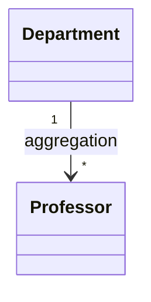
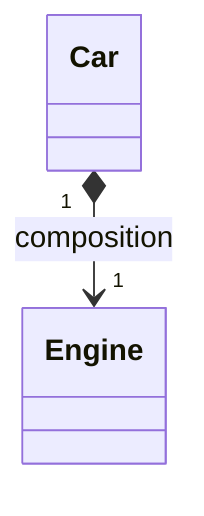

# Java 中的聚合(Aggregation)与组合(Composition)关系

在面向对象编程中，聚合和组合是两种重要的对象关系，它们都属于"has-a"关系（整体与部分的关系），但在生命周期管理上有重要区别。

## 1. 聚合关系 (Aggregation)

### 特点
- **弱"拥有"关系**：部分可以独立于整体存在
- **生命周期不绑定**：整体消失时，部分可能仍然存在
- **表示方式**：通常通过构造函数或setter方法注入

### UML 表示


### 代码示例
```java
class Professor {
    private String name;
    // 构造函数、getter/setter等
}

class Department {
    private List<Professor> professors;
    
    // 聚合关系 - 教授可以独立于系存在
    public Department(List<Professor> professors) {
        this.professors = professors;
    }
    
    public void addProfessor(Professor p) {
        professors.add(p);
    }
}
```

## 2. 组合关系 (Composition)

### 特点
- **强"拥有"关系**：部分不能独立于整体存在
- **生命周期绑定**：整体消失时，部分也必须消失
- **表示方式**：通常在整体内部创建部分对象

### UML 表示


### 代码示例
```java
class Engine {
    private String type;
    // 构造函数、方法等
}

class Car {
    private final Engine engine;  // 组合关系
    
    // 组合关系 - 发动机不能独立于汽车存在
    public Car(String engineType) {
        this.engine = new Engine(engineType);  // 在内部创建
    }
    
    // 没有setter方法，防止外部修改
}
```

## 3. 关键区别

| 特性                | 聚合 (Aggregation)       | 组合 (Composition)       |
|--------------------|-------------------------|-------------------------|
| 关系强度            | 弱关系                   | 强关系                   |
| 生命周期            | 独立                     | 依赖                     |
| 代码实现            | 外部传入部分对象           | 内部创建部分对象           |
| 部分对象可否共享     | 可以                     | 不可以                   |
| UML表示             | 空心菱形箭头               | 实心菱形箭头               |

## 4. 实际应用场景

### 聚合适用场景
- 大学和教师（教师可以属于多个大学或独立存在）
- 购物车和商品（商品可以存在于多个购物车中）
- 乐队和音乐家（音乐家可以参加多个乐队）

### 组合适用场景
- 订单和订单项（订单项不能独立于订单存在）
- 汽车和发动机（特定发动机只属于一辆汽车）
- 树和节点（节点不能独立于树存在）

## 5. Java 实现最佳实践

### 聚合实现要点
```java
class Team {
    private List<Player> players;
    
    // 通过构造函数注入
    public Team(List<Player> players) {
        this.players = new ArrayList<>(players);  // 防御性拷贝
    }
    
    // 通过方法添加
    public void addPlayer(Player p) {
        players.add(p);
    }
}
```

### 组合实现要点
```java
class House {
    private final Room livingRoom;
    private final Room kitchen;
    
    // 在构造函数中创建部分对象
    public House() {
        this.livingRoom = new Room("Living Room", 20.0);
        this.kitchen = new Room("Kitchen", 15.0);
    }
    
    // 通常不提供setter方法
}
```

## 6. 常见误区与注意事项

1. **误用继承代替组合**：优先使用组合而非继承
   ```java
   // 不好：用继承表示"has-a"关系
   class Car extends Engine {}
   
   // 好：使用组合
   class Car {
       private Engine engine;
   }
   ```

2. **混淆两种关系**：根据生命周期需求正确选择

3. **忽略不可变性**：组合关系中的部分对象通常应为final

4. **内存泄漏风险**：组合关系中注意正确实现销毁逻辑

## 7. 设计原则应用

1. **合成复用原则**：优先使用对象组合/聚合，而不是继承

2. **单一职责原则**：通过组合将不同职责分离到不同类中

3. **迪米特法则**：通过聚合/组合减少类之间的直接依赖

正确理解和应用聚合与组合关系，可以使Java程序的设计更加灵活、可维护，同时更好地反映真实世界中的对象关系。