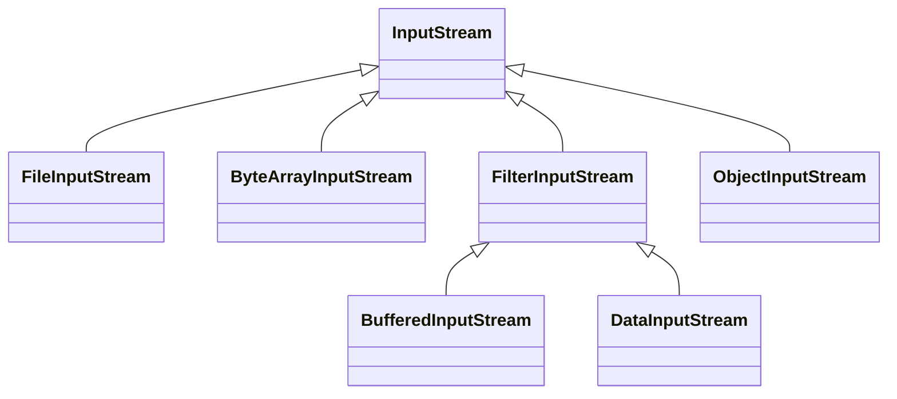
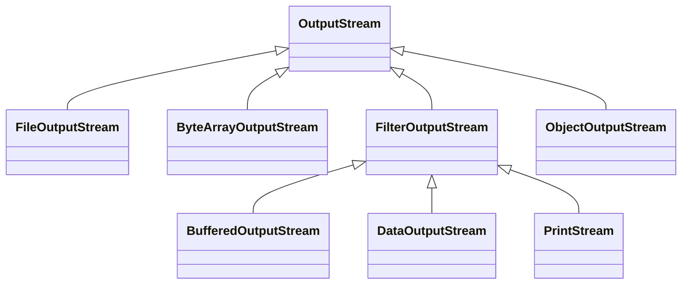
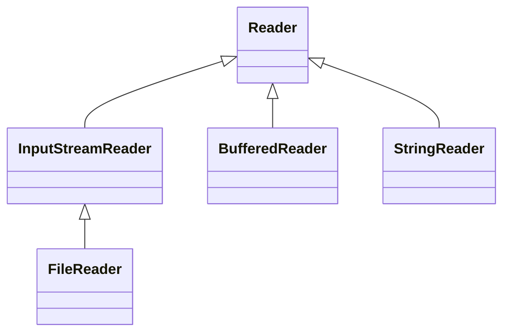
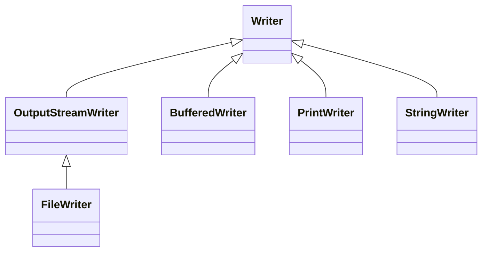

在 Java 中，文件操作相关的类主要分为 **字节流（Byte Streams）** 和 **字符流（Character Streams）**，它们分别继承自 `InputStream`/`OutputStream` 和 `Reader`/`Writer`。以下是完整的继承架构和关键类说明：

---

## **1. 字节流（Byte Streams）**
### **(1) 输入流（`InputStream` 继承体系）**

- **核心类**：
  - `FileInputStream`：从文件读取字节。
  - `ByteArrayInputStream`：从内存字节数组读取。
  - `BufferedInputStream`：带缓冲的读取，提升性能。
  - `DataInputStream`：读取基本数据类型（如 `int`, `double`）。
  - `ObjectInputStream`：读取序列化对象。

### **(2) 输出流（`OutputStream` 继承体系）**

- **核心类**：
  - `FileOutputStream`：写入字节到文件。
  - `ByteArrayOutputStream`：写入字节到内存数组。
  - `BufferedOutputStream`：带缓冲的写入。
  - `DataOutputStream`：写入基本数据类型。
  - `PrintStream`（如 `System.out`）：格式化输出（如 `print()`/`println()`）。
  - `ObjectOutputStream`：写入序列化对象。

---

## **2. 字符流（Character Streams）**
### **(1) 输入流（`Reader` 继承体系）**

- **核心类**：
  - `FileReader`：从文件读取字符（自动处理编码）。
  - `BufferedReader`：带缓冲的字符读取（支持 `readLine()`）。
  - `StringReader`：从字符串读取。

### **(2) 输出流（`Writer` 继承体系）**

- **核心类**：
  - `FileWriter`：写入字符到文件（自动处理编码）。
  - `BufferedWriter`：带缓冲的字符写入。
  - `PrintWriter`：格式化字符输出（如 `print()`/`println()`）。
  - `StringWriter`：写入到字符串。

---

## **3. 其他关键文件操作类**
### **(1) `RandomAccessFile`**
- **功能**：支持随机读写文件（可移动指针）。
- **模式**：
  - `"r"`：只读。
  - `"rw"`：读写。
- **示例**：
  ```java
  RandomAccessFile raf = new RandomAccessFile("file.txt", "rw");
  raf.seek(100); // 跳转到第100字节
  raf.write("Hello".getBytes());
  raf.close();
  ```

### **(2) `Files` 和 `Paths`（NIO.2，Java 7+）**
- **`Files`**：提供静态方法（如 `readAllBytes()`, `write()`, `copy()`）。
- **`Paths`**：生成 `Path` 对象（替代 `File` 类）。
- **示例**：
  ```java
  Path path = Paths.get("file.txt");
  byte[] data = Files.readAllBytes(path);
  Files.write(path, "New Content".getBytes());
  ```

---

## **4. 继承架构对比表**
| 类型          | 字节流                | 字符流                |
|---------------|-----------------------|-----------------------|
| **抽象基类**  | `InputStream`/`OutputStream` | `Reader`/`Writer` |
| **文件操作**  | `FileInputStream`/`FileOutputStream` | `FileReader`/`FileWriter` |
| **缓冲流**    | `BufferedInputStream`/`BufferedOutputStream` | `BufferedReader`/`BufferedWriter` |
| **内存操作**  | `ByteArrayInputStream`/`ByteArrayOutputStream` | `StringReader`/`StringWriter` |
| **数据处理**  | `DataInputStream`/`DataOutputStream` | 无直接等价类 |

---

## **5. 如何选择？**
- **字节流**：处理二进制文件（如图片、音频）、网络传输。
- **字符流**：处理文本文件（自动处理编码，如 UTF-8）。
- **NIO.2**（`Files`/`Paths`）：简化文件操作（推荐 Java 7+ 使用）。

---

## **6. 完整示例**
### **(1) 字节流复制文件**
```java
try (InputStream is = new FileInputStream("source.jpg");
     OutputStream os = new FileOutputStream("target.jpg")) {
    byte[] buffer = new byte[1024];
    int bytesRead;
    while ((bytesRead = is.read(buffer)) != -1) {
        os.write(buffer, 0, bytesRead);
    }
}
```

### **(2) 字符流读取文本文件**
```java
try (BufferedReader reader = new BufferedReader(new FileReader("text.txt"))) {
    String line;
    while ((line = reader.readLine()) != null) {
        System.out.println(line);
    }
}
```

### **(3) NIO.2 快速读写**
```java
Path path = Paths.get("text.txt");
String content = Files.readString(path, StandardCharsets.UTF_8); // Java 11+
Files.write(path, "New Text".getBytes());
```

---

## **总结**
- **字节流**：`InputStream`/`OutputStream` 体系，处理二进制数据。
- **字符流**：`Reader`/`Writer` 体系，处理文本数据。
- **NIO.2**：更现代的 API（`Files`/`Paths`/`Path`）。
- **随机访问**：`RandomAccessFile`。

掌握这些类的继承关系，能更灵活地选择适合的 API 进行文件操作！