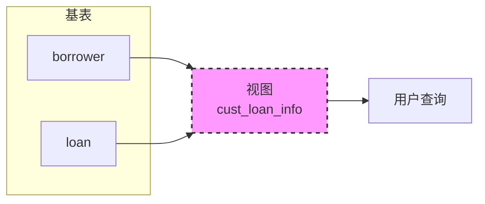

这节课进入 **View（视图）** 部分。这是数据库中的一个重要概念，我来帮你系统地梳理课件内容。

---

## 一、为什么需要视图？（视图的由来）

课件开篇给出了一个**业务场景**：

> 考虑一个人：他需要知道**客户的姓名、贷款编号、分行名称**，但**不需要看到贷款金额**。

- 实际数据库中的 `loan` 表包含 `amount`（金额）字段，但这个人不该看到
- 直接给他整个 `loan` 表 → **权限过大**，违反安全原则
- 解决方案：给他一个 **只包含他需要看到的列的“虚拟表”** → 这就是**视图**

---

## 二、什么是视图（View）？

课件给出的定义：

> **View** 是**保存下来的 SQL SELECT 语句**，可以在查询中作为一个数据源来引用。

### 核心特点

| 特点 | 说明 |
|------|------|
| **虚表（virtual table）** | 不存储实际数据 |
| **只存放定义** | 数据库中只保存视图的 SELECT 语句 |
| **数据来自基表** | 每次查询视图时，动态执行 SELECT 语句获取最新数据 |
| **基表变化 → 视图变化** | 因为查询是动态执行的 |

### 教材中的比喻

- **子模式（Sub-schema）**：数据库的一个"裁剪"视图，只暴露用户需要看到的部分

---

## 三、视图 vs 基表

| 对比项 | 基表（Base Table） | 视图（View） |
|--------|-------------------|--------------|
| 数据存储 | 实际存储数据 | 不存储，只存定义 |
| 数据变化 | 直接修改 | 基表变化时，视图查询结果自动变化 |
| 占用空间 | 占用磁盘空间 | 几乎不占用 |
| 增删改 | 可以随意操作 | 有限制（后面会讲） |

---

## 四、课件中的例子

### 场景：某个用户需要看到客户的姓名、贷款编号、分行名称，但不需要贷款金额

### 涉及的基表

```sql
borrower(customer_name, loan_number)
loan(loan_number, branch_name, amount)
```

### 创建视图的 SQL

```sql
CREATE VIEW cust_loan_info AS
SELECT customer_name, borrower.loan_number, branch_name
FROM borrower, loan
WHERE borrower.loan_number = loan.loan_number;
```

### 效果

- 用户查询 `cust_loan_info` 时，只能看到三列
- `loan.amount`（贷款金额）被隐藏了
- 实现了**数据安全**和**最小权限原则**

---

## 五、视图的四个核心方面

课件最后一页给出视图学习的四个维度：

1. **Define view（定义视图）** —— 如何创建
2. **Query view（查询视图）** —— 如何使用
3. **Update view（更新视图）** —— 是否支持、有什么限制
4. **The function of view（视图的作用）** —— 为什么要用

---

## 六、视图的主要作用

| 作用 | 说明 |
|------|------|
| **安全性** | 隐藏敏感字段，只暴露必要数据 |
| **简化查询** | 把复杂的多表连接存成视图，用户直接 `SELECT * FROM 视图` |
| **逻辑数据独立性** | 基表结构变化时，通过修改视图定义，避免应用程序改动 |
| **数据聚合** | 可以创建预聚合的视图（如按部门统计的人数） |

---

## 七、课件知识点总结



- 视图是一个**虚表**（虚线边框）
- 只存 SELECT 语句，不存数据
- 查询视图时实时执行，所以基表变化会立刻反映到视图

---

## 八、下一课预告

根据视图的四个维度，后面应该会讲：
- 视图的**创建语法**（CREATE VIEW...）
- 视图的**查询**（和普通表一样用）
- 视图的**更新限制**（什么情况下能 INSERT/UPDATE/DELETE）
- 视图的高级功能：**WITH CHECK OPTION** 等

如果你有后续的视图课件，可以继续发给我，我帮你继续拆解。也可以提前问你一个问题：

> **你觉得下面这个视图可以更新吗？为什么？**  
> `CREATE VIEW avg_balance AS SELECT branch_name, AVG(balance) FROM account GROUP BY branch_name;`