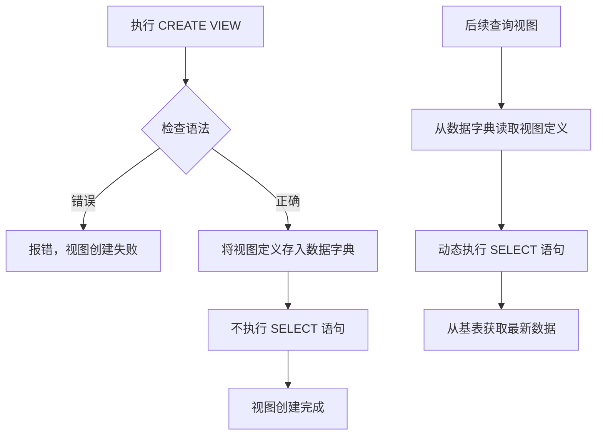

这节课讲的是 **创建视图（CREATE VIEW）** 的完整语法，包括 `WITH CHECK OPTION` 的作用、列名的指定规则等。我帮你系统梳理。

---

## 一、CREATE VIEW 完整语法

```sql
CREATE VIEW <视图名> [(<列名> [, <列名>]...)]
AS <子查询>
[WITH CHECK OPTION];
```

### 各部分的含义

| 部分 | 说明 |
|------|------|
| `视图名` | 给视图起一个名字 |
| `列名` | 可选。不写则使用 SELECT 中的列名 |
| `子查询` | 定义视图的 SELECT 语句（**不执行**，只存定义） |
| `WITH CHECK OPTION` | 可选。对视图进行增删改时，检查是否满足视图条件 |

### 重要机制

> **RDBMS 执行 CREATE VIEW 时，只把视图的定义存入数据字典，并不执行 SELECT 语句。**
> 
> 只有在**查询视图**时，才会根据定义从基表中动态查出数据。

---

## 二、例1：建立软件学院学生的视图（省略列名）

```sql
CREATE VIEW sf_stu AS
SELECT sid, sname, sage
FROM student
WHERE sdept = '软件学院';
```

### 特点
- 视图的列名自动取 SELECT 中的列名：`sid`、`sname`、`sage`
- 查询 `sf_stu` 时，只能看到软件学院的学生

### 查询视图示例
```sql
SELECT * FROM sf_stu;  -- 只返回软件学院的学生
```

---

## 三、例2：带 WITH CHECK OPTION 的视图

```sql
CREATE VIEW sf_stu AS
SELECT sid, sname, sage
FROM student
WHERE sdept = '软件学院'
WITH CHECK OPTION;
```

### WITH CHECK OPTION 的作用

> 对视图进行 **INSERT、UPDATE、DELETE** 操作时，保证操作后的行**仍然满足视图定义中的条件**。

### 具体表现

| 操作 | 无 WITH CHECK OPTION | 有 WITH CHECK OPTION |
|------|---------------------|---------------------|
| 插入一条 `sdept='计算机学院'` 的记录 | ✅ 可以插入（但插入后视图中看不到） | ❌ 拒绝插入 |
| 更新某学生的 `sdept` 从'软件学院'改为'计算机学院' | ✅ 可以更新（但更新后视图中消失） | ❌ 拒绝更新 |
| 删除软件学院学生 | ✅ 可以删除 | ✅ 可以删除（删除后自然看不到了） |

### 为什么需要它？

- 保证视图的**一致性**：视图中的行始终满足定义条件
- 防止**"插入后看不见"**的奇怪现象
- 防止**"更新后从视图中消失"**的意外

---

## 四、何时需要明确指定视图的列名？

课件列出了三种情况：

### 1. 目标列是聚集函数或表达式

```sql
-- ❌ 错误：没有列名
CREATE VIEW avg_balance AS
SELECT AVG(balance) FROM account;

-- ✅ 正确：指定列名
CREATE VIEW avg_balance (avg_bal) AS
SELECT AVG(balance) FROM account;
```

### 2. 多表连接时有同名列

```sql
-- 两个表都有 sid 列，需要区分
CREATE VIEW stu_sc (sno, sname, cno, grade) AS
SELECT student.sid, student.sname, sc.cno, sc.grade
FROM student, sc
WHERE student.sid = sc.sid;
```

### 3. 需要给列起更合适的名字

```sql
CREATE VIEW sf_stu (学号, 姓名, 年龄) AS
SELECT sid, sname, sage
FROM student
WHERE sdept = '软件学院'
WITH CHECK OPTION;
```

---

## 五、列名规则总结

| 情况 | 是否可以省略列名 | 说明 |
|------|-----------------|------|
| SELECT 中的列都是普通列名（无重复、无表达式） | ✅ 可以 | 自动使用 SELECT 中的列名 |
| 有聚集函数（COUNT、AVG等） | ❌ 必须指定 | 聚集函数没有列名 |
| 有表达式（balance*1.05 等） | ❌ 必须指定 | 表达式没有列名 |
| 多表连接有同名列 | ❌ 必须指定 | 需要明确区分 |
| 想使用中文/更合适的列名 | ❌ 必须指定 | 自定义列名 |

---

## 六、CREATE VIEW 执行流程图



---

## 七、几个重要概念对比

| 概念 | CREATE VIEW 时 | 查询视图时 |
|------|---------------|-----------|
| SELECT 语句 | 只存定义，不执行 | 动态执行 |
| 基表数据 | 不检查 | 实时读取 |
| 占用的存储空间 | 极少（只存定义文本） | 不存储 |

---

## 八、知识点速查表

```sql
-- 基本创建（省略列名）
CREATE VIEW view_name AS
SELECT col1, col2 FROM table WHERE condition;

-- 指定列名
CREATE VIEW view_name (new_col1, new_col2) AS
SELECT col1, col2 FROM table WHERE condition;

-- 带检查选项
CREATE VIEW view_name AS
SELECT col1, col2 FROM table WHERE condition
WITH CHECK OPTION;

-- 删除视图
DROP VIEW view_name;
```

---

## 九、思考题（来自上次的问题）

现在可以回答上次的问题了：

```sql
CREATE VIEW avg_balance AS
SELECT branch_name, AVG(balance) FROM account GROUP BY branch_name;
```

**Q：这个视图可以更新吗？为什么？**

A：**不可以。** 因为：
1. 包含聚集函数 `AVG(balance)`
2. 包含 `GROUP BY` 分组

这类视图无法反向映射回基表的某一行，所以是**只读视图**。如果尝试 `INSERT/UPDATE/DELETE`，会报错。

---

如果你有后续关于**查询视图**或**更新视图**的课件，可以继续发给我。