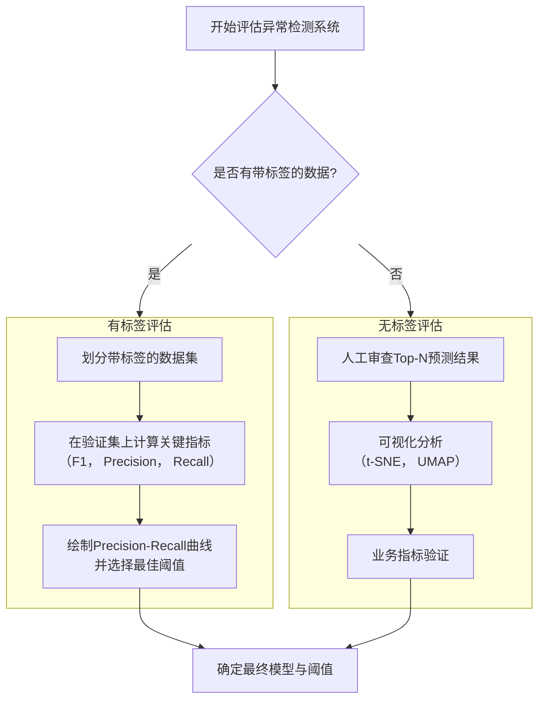

好的，我们重点深入讲解评估方法并详细澄清如何选择更广义的“阈值”。

### 异常检测系统的评估方法

评估是无监督异常检测中最关键也最具挑战的一环。其核心在于：**在没有明确标签的情况下，我们如何知道模型的好坏？**

评估方法主要分为两大路径，其整体流程与决策点如下图所示：

#### 路径一：有标签时的定量评估（理想情况）

当你能获取到一部分带有“正常”/“异常”标签的数据时，评估就变得非常坚实和客观。

**1. 关键评估指标（为什么不用准确率）**

在极度不平衡的数据集（比如99.9%正常，0.1%异常）中，准确率是毫无意义的指标。一个永远预测“正常”的“笨”模型，其准确率也能达到99.9%。因此，我们必须使用更细致的指标：

*   **精确率**：**“宁错杀一千，不放过一个”的代价指标。**
    *   `Precision = TP / (TP + FP)`
    *   **解读**：在所有被模型判定为异常的点中，有多少是真正的异常？**高精确率意味着低误报率。** 如果你的业务场景是“每次误报都会引起巨大成本或恐慌”（如启动紧急停机流程），那么你需要追求高精确率。

*   **召回率**：**“天网恢恢，疏而不漏”的覆盖度指标。**
    *   `Recall = TP / (TP + FN)`
    *   **解读**：在所有真正的异常点中，有多少被模型成功抓住了？**高召回率意味着低漏报率。** 如果你的业务场景是“漏掉一个异常的代价远高于多次误报”（如金融欺诈检测、恶性肿瘤筛查），那么你需要追求高召回率。

*   **F1-Score**：**精确率和召回率的“调和平均数”。**
    *   `F1 = 2 * (Precision * Recall) / (Precision + Recall)`
    *   **解读**：它是Precision和Recall的加权平衡。当Precision和Recall都很高时，F1才会高。它是选择一个“均衡”模型时的最佳单一指标。

*   **Precision-Recall曲线**：
    *   **为什么它比ROC曲线更重要？** 在不平衡数据中，ROC曲线下的面积（AUC-ROC）可能会显得过于乐观，因为大量的真阴性（TN）会使得假阳性率（FPR）看起来很小。而PR曲线直接聚焦于我们关心的两个核心指标：精确率和召回率，它对类别不平衡非常敏感，因此能更好地反映模型在异常点上的真实性能。

**2. 如何利用这些指标调参和选择阈值**

这个过程直接回答了如何选择阈值的问题。

1.  **在验证集上预测**：用你训练好的模型为验证集的每个样本计算一个**连续的异常分数**。
2.  **遍历阈值**：从一个最小值到最大值，遍历所有可能的阈值。
3.  **计算指标**：对于每一个候选阈值，将所有异常分数高于该阈值的点预测为“异常”，反之则为“正常”。然后与真实标签对比，计算该阈值下的Precision和Recall。
4.  **绘制PR曲线**：以Recall为横轴，Precision为纵轴，绘制出所有阈值下的点。
5.  **选择最佳阈值**：
    *   **方法A（业务目标明确）**：如果你的业务对Precision或Recall有明确要求（例如，“Recall必须达到90%以上”），那么直接在曲线上找到满足该要求且另一个指标尽可能高的点，其对应的阈值就是你的选择。
    *   **方法B（追求平衡）**：计算每个阈值对应的F1-Score，选择**使F1-Score最大化的那个阈值**。这是最常用的方法。

#### 路径二：无标签时的评估（现实情况）

这是更常见的场景，评估更具探索性和交互性。

**1. 人工审查Top-N异常**

*   **操作**：让模型在整个数据集或一个保留集上运行，并输出按异常分数从高到低排序的列表。让领域专家审查排名最靠前的N个（例如，前50或100个）样本。
*   **度量**：计算**精确率@K**，即在Top-K个结果中，被专家确认为真正异常的比例。
    *   如果`Precision@50 = 80%`，意味着模型认为最异常的50个点里，有40个是真正的异常。这已经是一个非常出色的模型了。
*   **意义**：这直接模拟了模型的实际使用场景——运维人员只会关注系统告警列表中最靠前的几条。这是最有说服力的评估方式之一。

**2. 可视化分析**

*   **操作**：使用t-SNE或UMAP等降维技术将高维数据投影到2D平面，然后将每个点的异常分数映射为颜色（红色代表高分/异常，蓝色代表低分/正常）。
*   **判断**：
    *   如果红色点大多位于蓝色“正常云团”的外围，或形成了独立的、远离主云团的小簇，说明模型是有效的。
    *   如果红色点随机散布在蓝色云团中，说明模型可能无效。

---

### 详解：如何选择“阈值”

我们真正要选择的，是一个**决策阈值**，这个阈值可以基于概率 \( p(x) \)，也可以基于异常分数 \( s(x) \)，Z-score等。

#### 场景一：基于高斯分布模型（吴恩达方法）

在这里，模型为每个样本计算一个概率 \( p(x) \)。

1.  **如果你有标签**：
    *   如上文所述，使用**验证集和PR曲线**，找到使F1-Score最大化的概率阈值 \( \epsilon \)。
    *   **例如**：你可能最终得到 \( \epsilon = 10^{-6} \)。当 \( p(x) < 10^{-6} \) 时，判定为异常。

2.  **如果你没有标签**：
    *   **基于分布假设**：如果你坚信数据服从高斯分布，可以基于标准分数的经验法则来设定阈值。例如，对于单个特征，你可以设定阈值为 \( \mu ± 3\sigma \)（对应Z-score的绝对值为3）。这大约覆盖了99.7%的数据，意味着有0.3%的数据会被视为异常。**这是一种启发式方法，需要谨慎使用。**
    *   **人工审查**：选择一个初始阈值（比如 \( \mu ± 2\sigma \)），输出Top-N异常给专家审查。如果专家认为大部分是误报，就调高阈值（比如提高到 \( \mu ± 3\sigma \)），让模型更“严格”；如果专家发现了很多漏报，就调低阈值（比如降低到 \( \mu ± 1.5\sigma \)），让模型更“敏感”。

#### 场景二：基于其他模型（如孤立森林、LOF）

这些模型输出的是一个“异常分数”，而不是概率。

1.  **如果你有标签**：
    *   **完全相同的方法**：在验证集上，遍历所有可能的异常分数阈值，绘制PR曲线，并找到最佳阈值。这是**最推荐、最科学的方法**。

2.  **如果你没有标签**：
    *   **分析分数分布**：绘制所有训练样本异常分数的直方图或密度图。通常，大部分正常样本的分数会集中在一个区域，而异常样本会形成另一个“长尾”或“离群”的分布。
        *   **对于孤立森林**：分数越接近1，越是异常。你可以观察分数的分布，找到一个“拐点”，将阈值设在那里。
        *   **对于LOF**：分数约等于1为正常，大于1为异常。同样寻找分布的长尾起点。
    *   **使用“极端值理论”**：假设异常分数服从某种分布，然后取该分布的某个高分位数（如99%分位数）作为阈值。这本质上是假设有1%的数据是异常的。
    *   **人工审查（同样适用）**：这是最可靠的无标签方法。通过审查Top-N结果来反复调整阈值。

### 总结：如何选择阈值

| 情况                   | 最佳方法                     | 具体操作                                                     |
| :--------------------- | :--------------------------- | :----------------------------------------------------------- |
| **有标签数据**         | **PR曲线 + F1优化**          | 在带标签的验证集上，找到使F1-Score最大化的阈值。这是黄金标准。 |
| **无标签数据**         | **人工审查Top-N + 业务反馈** | 通过领域专家对模型输出的Top异常进行评判，根据精确率@K和业务需求反复迭代调整阈值。 |
| **无标签数据（替代）** | **启发式规则**               | 分析异常分数的分布，寻找“拐点”，或使用分位数（如设定99分位数为阈值）。风险较高，需结合业务理解。 |

**核心思想**：阈值的选择不是一个纯粹的数学问题，而是一个**业务权衡问题**。它最终决定了你的系统是“敏感”还是“稳定”。这个决策必须结合业务成本（漏报成本 vs. 误报成本）来做出，而上述方法是为这个决策提供数据支持的工具。