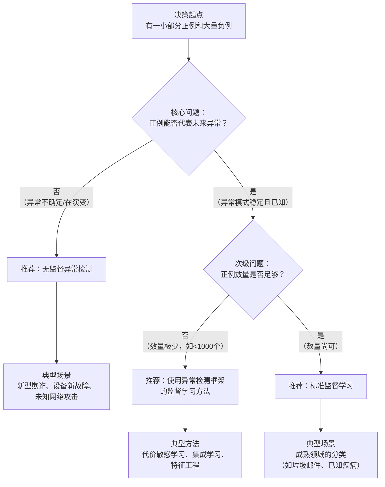

好的，这是一个非常实际且重要的问题。我们来详细探讨在**有一小部分正例（异常）和大量负例（正常）** 的情况下，如何选择异常检测与监督学习，并结合具体场景进行分析。

### 核心决策框架

这个决策的核心在于：**我们拥有的“一小部分正例”是否足以代表未来可能出现的所有异常模式？**

下图清晰地展示了基于这一核心问题衍生出的决策路径：

基于上图展示的决策路径，我们可以深入理解每个选择背后的逻辑和具体应用场景。

---

### 何时选择异常检测？

当**正例（异常）无法代表未来所有异常**时，无监督异常检测是更安全、更可靠的选择。这是因为模型学习的重点是“正常是什么”，任何偏离正常的都是可疑的。

**关键特征：**
*   **未知的异常**：未来的异常可能与已知的异常截然不同（**概念漂移**）。
*   **异常类型繁多**：异常的种类可能非常多，你拥有的正例只是冰山一角。
*   **正例数据不可靠**：正例样本的标签可能不准确或不完整。

**具体场景分析：**

1.  **金融欺诈检测**
    *   **情况**：你有一些已知的欺诈手段（如盗刷）的样本，但欺诈分子在不断创新，新的欺诈手段（如网络钓鱼、洗钱新手法）层出不穷。
    *   **选择**：**异常检测**。
    *   **理由**：一个只学会了识别已知欺诈类型的监督学习模型，会对新型欺诈完全“盲视”。而异常检测模型通过建模正常用户的行为模式，一旦出现任何“不正常”的交易（无论是已知还是未知欺诈），都有可能被捕获。

2.  **工业设备故障预测**
    *   **情况**：你收集了机器正常运行的大量数据，只有少数几种历史故障数据。
    *   **选择**：**异常检测**。
    *   **理由**：机器可能会出现一种从未记录过的全新故障模式。监督学习模型无法识别它，但异常检测模型可以检测到与正常状态任何形式的显著偏离，从而提供早期预警。

3.  **网络安全入侵检测**
    *   **情况**：你已知一些攻击签名（如特定病毒、漏洞利用），但每天都有新的零日漏洞和新型攻击出现。
    *   **选择**：**异常检测**。
    *   **理由**：系统旨在发现任何“异常”的网络流量或行为模式，这对于发现新型的、未知的网络攻击至关重要。

---

### 何时选择监督学习？

当**正例（异常）能够很好地代表未来会遇到的异常，并且数量相对足够**时，监督学习会表现得更强大、更精确。

**关键特征：**
*   **稳定的异常模式**：异常的类型相对固定，不会频繁出现新的未知类型。
*   **充足且有代表性的正例**：你拥有的正例覆盖了大多数常见的异常类别，并且每个类别有足够的样本供模型学习。
*   **目标是指标明确**：你的目标就是精准识别这些特定的、已知的异常类别。

**具体场景分析：**

1.  **垃圾邮件检测**
    *   **情况**：你拥有数十万个正常的邮件和数万个被标记为垃圾邮件的样本。垃圾邮件虽然形式多样，但其核心目的和模式（包含特定关键词、链接、发送行为）是相似的。
    *   **选择**：**监督学习（分类）**。
    *   **理由**：这是一个相对成熟的问题，垃圾邮件的模式虽然进化，但不会出现颠覆性的改变。监督学习模型（如朴素贝叶斯、逻辑回归、深度学习）可以非常精确地从内容、元数据等特征中学习到垃圾邮件的判别边界，准确率通常高于99%。

2.  **医疗图像诊断（已知疾病）**
    *   **情况**：你要检测一种特定的、已知的疾病（如糖尿病性视网膜病变）。你拥有大量正常的眼底图像和大量已被专家确诊的病变图像。
    *   **选择**：**监督学习（分类）**。
    *   **理由**：这里的“异常”（病变）模式是明确的、可定义的。监督模型（如CNN）能够学习到病变区域的细微特征，达到甚至超过人类专家的水平。它的目标是精确区分“正常”和“该特定病变”，而不是发现所有可能的眼部异常。

3.  **产品质量分类（已知缺陷）**
    *   **情况**：在生产线上，产品可能出现的缺陷类型是固定的几种（如划痕、凹陷、污渍），并且你已经收集了足够多的各种缺陷样本。
    *   **选择**：**监督学习（多分类）**。
    *   **理由**：模型不仅可以判断产品是否合格，甚至可以精确地告诉你它属于哪种缺陷类型，这对于指导生产流程改进非常有价值。

---

### 灰色地带：当正例数量“不多不少”时怎么办？

这是最常见的情况：你有一些正例，但不够多，不足以训练一个稳健的监督学习模型。此时，你可以采用一种 **“使用异常检测框架的监督学习”** 思路。

**核心思想：** 不把问题看作“正常 vs. 异常”的分类，而是看作 **“正常 vs. 已知异常 vs. 未知异常”** 的问题。利用已知异常的信息来**增强**无监督异常检测模型。

**具体技术与策略：**

1.  **半监督学习**：
    *   **方法**：使用大量无标签数据（假设大部分是正常）来学习正常的表示或分布，然后使用少量的正例（异常）来微调决策边界或辅助选择阈值。
    *   **示例**：训练一个自编码器来重构正常数据。在评估时，重构误差高的点被认为是异常。你可以利用已知的正例来确定一个更合理的重构误差阈值，而不是简单地选择一个统计分位数。

2.  **代价敏感学习**：
    *   **方法**：在监督学习算法中，通过调整类别权重，赋予正例（异常）更高的误分类代价。这迫使模型更加关注少数类，即使其数量很少。
    *   **示例**：在使用SVM或决策树时，设置 `class_weight='balanced'` 或手动为异常类赋予更高的权重。

3.  **数据增强与集成学习**：
    *   **方法**：对少数类（正例）进行过采样（如SMOTE算法），或使用集成方法（如Isolation Forest本身对不平衡数据友好）来缓解数据不平衡问题。

### 总结与决策清单

为了帮助你做出选择，可以问自己以下几个问题：

1.  **未来的异常是新的、未知的吗？**
    *   **是** -> 强烈倾向于 **异常检测**。
    *   **否** -> 考虑监督学习。

2.  **我拥有的正例，能覆盖所有我想找的异常类型吗？**
    *   **不能** -> 强烈倾向于 **异常检测**。
    *   **能** -> 考虑监督学习。

3.  **我拥有的正例数量足够多吗？（通常，至少每类有数百到数千个样本）**
    *   **不够** -> 倾向于 **异常检测**，或尝试**半监督/代价敏感学习**。
    *   **足够** -> **监督学习** 可能是最佳选择。

4.  **我的目标是找到“任何不正常的东西”，还是“特定的几种不正常的东西”？**
    *   **“任何不正常的东西”** -> **异常检测**。
    *   **“特定的几种”** -> **监督学习**。

**最终建议：**
*   **当不确定时，先从无监督异常检测开始。** 因为它对未知风险更具鲁棒性，并且实现起来通常更简单。
*   你可以将无监督异常检测模型的输出，与一个简单的监督模型（基于你已知的少量正例）的结果进行结合，形成一个混合系统，兼顾已知和未知的威胁。