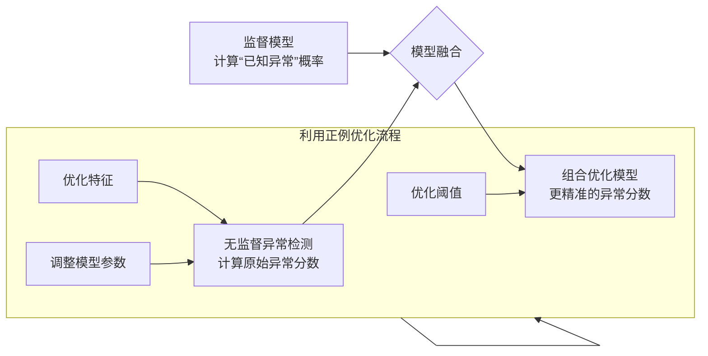

好的，没问题！这个“正例不多不少”的灰色地带确实最让人困惑。我们抛开术语，用一个非常具体的例子来把它讲透。

### 核心困境：食之无味，弃之可惜

想象一下，你是一个银行的风控专家。

*   **你拥有**：1千万条正常的交易记录。
*   **你也拥有**：**500条**确凿的欺诈交易记录。

现在，你要构建一个反欺诈系统。你的困境是：

1.  **只用异常检测（无监督）**：只用那1千万正常记录来建模。这会浪费那**500条**宝贵的、已知的欺诈信息。模型可能会把一种已知的、有明确模式的欺诈也当成“未知异常”，而实际上我们本可以更精准地识别它。
2.  **直接用监督学习**：把1千万正常数据和500条欺诈数据放在一起，训练一个二分类模型。问题是，**500条相对于1千万条来说太少了！** 模型会严重偏向于“正常”类，它很可能根本学不会欺诈的模式，或者非常不稳定，因为信号太微弱了。

这就是“正例不多不少”的尴尬：**多到让你觉得不用可惜，少到让你用了又担心效果不好。**

---

### 解决方案：不是二选一，而是“一加一”

在这种情况下，我们不是要在“异常检测”和“监督学习”之间做单选题，而是要想办法 **“把已知的欺诈知识，注入到异常检测的框架中去”**。

下图展示了如何将少量宝贵的正例（已知异常）信息，融入到无监督异常检测的流程中，以优化最终结果：

下面我们来拆解图中的几种具体做法：

#### 方法一：用正例来“校准”异常检测的阈值

这是最简单、最直接的方法。

*   **无监督的做法**：模型输出异常分数后，我们可能简单地选择最高的0.1%作为异常（比如分数 > 0.99）。
*   **“一加一”的做法**：
    1.  让模型在那**500条已知欺诈**数据上跑一遍，看看它们的异常分数分别是多少。
    2.  你可能会发现，这500条欺诈记录中，大部分（比如400条）的分数都高于0.98，但有100条的分数在0.90到0.98之间。
    3.  **决策**：为了让系统能抓住更多*已知类型*的欺诈，你果断地将阈值从0.99**下调到0.90**。这样，你既利用了无监督模型发现未知异常的能力，又利用已知欺诈信息调整了它的“灵敏度”，确保已知模式不被漏掉。

**本质**：你用一个**有指导的、数据驱动的方式** 选择了阈值，而不是拍脑袋。

#### 方法二：用正例来“增强”特征或模型

*   **操作**：分析那500条欺诈交易，看看它们有没有**共同的特征**。比如，你发现它们大多数发生在深夜，并且交易金额非常规。
*   **应用**：你可以基于这个洞察，在异常检测模型里手动构造一个新的、更有区分度的特征，比如 `(交易金额) * (是否深夜)`。这样，模型在计算异常分数时，就会给这个新模式更高的权重。
*   **进阶做法 - 半监督学习**：
    1.  **第一步（无监督）**：用所有数据（包括那500条欺诈，但不告诉模型标签）来训练一个模型，比如一个**自编码器**，让它学习所有交易数据的通用表示。
    2.  **第二步（有监督）**：然后，在这个学到的“通用表示”之上，只用那**500条带标签的数据**训练一个小的、简单的分类器（比如逻辑回归）。
    3.  **效果**：这个小的分类器因为站在了巨人（自编码器）的肩膀上，即使只有500个样本，也能很好地学会区分已知的欺诈。而自编码器本身依然保留了发现未知异常的能力。

#### 方法三：构建一个混合投票系统

这是一种更工程化的做法。

*   **系统A**：一个标准的无监督异常检测模型（如孤立森林）。
*   **系统B**：一个只在**500条正例**和随机抽取的5000条负例上训练的小型监督学习模型。

当一笔新交易进来时：
1.  **系统A** 给它一个异常分数 `S_A`。
2.  **系统B** 给它一个“是已知欺诈”的概率 `S_B`。
3.  **最终决策**：
    *   如果 `S_B` 很高（比如 > 0.9），说明它非常像我们已知的欺诈，直接拒绝。
    *   如果 `S_A` 很高但 `S_B` 不高，说明它可能是一种*新型*欺诈，需要重点审核。
    *   如果两者都不高，则通过。

### 总结与类比

**“正例不多不少”时的策略，可以类比于一位老侦探：**

1.  **他的毕生经验（无监督模型）** 让他对“不正常”的事情有极强的直觉，能发现任何蛛丝马迹。
2.  **他手头有一摞已知罪犯的档案（500个正例）**。他不会把这些档案扔掉，而是会：
    *   **校准直觉**：用这些档案来提醒自己：“哦，原来这种长相/行为的人也是坏蛋，我以后得对这类人多留个心眼。”（**对应方法一：调整阈值**）
    *   **总结模式**：从档案中发现规律，比如“大多数罪犯都喜欢在雨天行动”，以后雨天他就格外警惕。（**对应方法二：特征工程**）
    *   **双线作战**：他既依靠自己的直觉在街上巡逻，也让手下新人专门去背那些已知罪犯的照片。两者结合，天网恢恢。（**对应方法三：混合系统**）

所以，当你的正例“不多不少”时，你的最佳策略是：

**以无监督异常检测为基石和框架，然后将你手头宝贵的正例作为“润滑剂”和“增强剂”，去优化这个框架的各个环节（阈值、特征、模型本身），从而得到一个既能发现“未知异常”，又能精准识别“已知异常”的强大系统。**