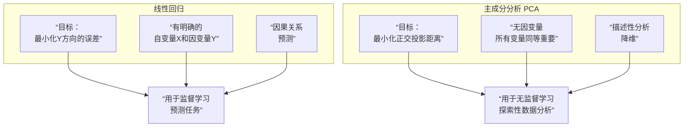

好的，这是一个非常经典且重要的问题。**PCA（主成分分析）** 和**线性回归**在图形上看起来都像是在拟合一条直线，但它们的目标、假设和数学本质有着根本的不同。

为了直观理解它们的核心区别，我们先来看一张对比图：



---

### 核心区别一览表

| 方面           | 线性回归                               | 主成分分析                                      |
| :------------- | :------------------------------------- | :---------------------------------------------- |
| **目标**       | **预测** - 根据X预测Y的值              | **降维/表征** - 找到数据方差最大的方向          |
| **变量角色**   | **不对称**：有自变量和因变量           | **对称**：所有变量同等处理，无因变量            |
| **误差最小化** | **垂直距离** - 最小化因变量Y方向的误差 | **正交距离** - 最小化数据点到主成分轴的垂直距离 |
| **数学基础**   | 最小二乘法，求解条件概率 P(Y           | X)                                              |
| **输出**       | 一个预测模型（系数、截距）             | 新的坐标系（主成分）、投影后的数据              |
| **学习类型**   | **监督学习**                           | **无监督学习**                                  |

---

### 直观几何区别

假设我们有两个变量 X1 和 X2。

#### 线性回归
- 如果我们把 X1 作为自变量，X2 作为因变量，线性回归会找到一条直线，使得所有数据点到这条直线的 **垂直距离（平行于X2轴）** 的平方和最小。
- **这条线不是数据点分布的主要方向**，它的唯一目的是用X1来最好地预测X2。

#### 主成分分析
- PCA对变量一视同仁。它会找到数据方差最大的方向，即**第一主成分**。
- 它最小化的是所有数据点到主成分轴的 **最短距离（正交/垂直距离）**。
- **这条线就是数据分布的主要轴线**。

---

### 数学本质区别

#### 线性回归的数学
目标是找到参数 \( \beta \)，最小化残差平方和：
`argmin Σ(y_i - ŷ_i)²`
其中 \( ŷ_i = β₀ + β₁x_i \)

**它只考虑因变量Y方向的误差。**

#### PCA的数学
目标是找到一个投影矩阵 \( W \)，使得投影后的数据方差最大，等价于最小化投影误差（数据点到投影子空间的距离）。
`argmin Σ ||x_i - x_proj_i||²`

**它考虑的是数据点在所有方向上的正交投影误差。**

---

### 具体例子说明

假设我们研究一群人的**身高**和**体重**。

#### 如果用线性回归：
- 我们会指定一个**因变量**和一个**自变量**。例如：
  - **场景A**：用身高（X）预测体重（Y）。我们最小化体重的预测误差。
  - **场景B**：用体重（X）预测身高（Y）。我们最小化身高的预测误差。
- **这是两种不同的模型**，会得到两条不同的直线。

#### 如果用PCA：
- 我们不区分因变量和自变量。我们只是看身高和体重这两个变量构成的二维数据集。
- PCA会找到一条新的轴（第一主成分），这个方向可能代表了“体型大小”这个综合概念，身高和体重在这个方向上都有贡献。
- 它会找到与第一条轴垂直的第二主成分（代表了在固定“体型大小”后，身高和体重的相对比例差异）。
- **我们得到的是一个新的坐标系**，用于更好地描述数据的结构。

---

### 代码演示与可视化

让我们用Python代码来直观展示这个区别。

```python
import numpy as np
import matplotlib.pyplot as plt
from sklearn.linear_model import LinearRegression
from sklearn.decomposition import PCA
from sklearn.preprocessing import StandardScaler

# 生成有相关性的示例数据
np.random.seed(42)
height = np.random.normal(170, 10, 100)  # 平均身高170cm
weight = 0.7 * height + np.random.normal(0, 5, 100) + 60  # 体重与身高相关

data = np.column_stack([height, weight])

# 中心化数据（为了可视化更清晰）
data_centered = data - data.mean(axis=0)

# 1. 线性回归：用身高预测体重
lr = LinearRegression()
lr.fit(data_centered[:, 0].reshape(-1, 1), data_centered[:, 1])  # X=身高, Y=体重

# 创建回归线
x_line = np.linspace(data_centered[:, 0].min(), data_centered[:, 0].max(), 100)
y_line_lr = lr.predict(x_line.reshape(-1, 1))

# 2. PCA
pca = PCA()
pca.fit(data_centered)

# 获取主成分
components = pca.components_
mean = data_centered.mean(axis=0)

# 创建主成分线（通过均值的向量方向）
pc1_slope = components[0, 1] / components[0, 0]  # 第一主成分的斜率
pc2_slope = components[1, 1] / components[1, 0]  # 第二主成分的斜率

x_line_pc1 = np.linspace(data_centered[:, 0].min(), data_centered[:, 0].max(), 100)
y_line_pc1 = pc1_slope * x_line_pc1

# 可视化
plt.figure(figsize=(15, 5))

# 图1：只有数据点
plt.subplot(1, 3, 1)
plt.scatter(data_centered[:, 0], data_centered[:, 1], alpha=0.6)
plt.title('原始数据点')
plt.xlabel('身高 (中心化)')
plt.ylabel('体重 (中心化)')
plt.axhline(y=0, color='k', linestyle='--', alpha=0.3)
plt.axvline(x=0, color='k', linestyle='--', alpha=0.3)
plt.axis('equal')

# 图2：线性回归 vs PCA
plt.subplot(1, 3, 2)
plt.scatter(data_centered[:, 0], data_centered[:, 1], alpha=0.6)

# 绘制线性回归线
plt.plot(x_line, y_line_lr, 'r-', linewidth=2, label='线性回归 (身高→体重)')

# 绘制主成分
plt.arrow(0, 0, components[0, 0]*30, components[0, 1]*30, head_width=2, head_length=2, fc='g', ec='g', linewidth=3, label='第一主成分')
plt.arrow(0, 0, components[1, 0]*10, components[1, 1]*10, head_width=2, head_length=2, fc='orange', ec='orange', linewidth=3, label='第二主成分')

plt.title('线性回归 vs PCA')
plt.xlabel('身高 (中心化)')
plt.ylabel('体重 (中心化)')
plt.axhline(y=0, color='k', linestyle='--', alpha=0.3)
plt.axvline(x=0, color='k', linestyle='--', alpha=0.3)
plt.legend()
plt.axis('equal')

# 图3：误差最小化方式对比
plt.subplot(1, 3, 3)
plt.scatter(data_centered[:, 0], data_centered[:, 1], alpha=0.6)

# 画几个示例点的误差线
sample_indices = [10, 30, 70]
for idx in sample_indices:
    x_pt, y_pt = data_centered[idx]
    
    # 线性回归误差（垂直距离）
    y_pred = lr.predict([[x_pt]])[0]
    plt.plot([x_pt, x_pt], [y_pt, y_pred], 'r--', alpha=0.8)
    
    # PCA误差（正交距离）
    # 点到第一主成分的投影
    point = np.array([x_pt, y_pt])
    projection = np.dot(point, components[0]) * components[0]  # 投影到第一主成分
    plt.plot([x_pt, projection[0]], [y_pt, projection[1]], 'g--', alpha=0.8)

plt.plot(x_line, y_line_lr, 'r-', linewidth=2, label='线性回归')
plt.arrow(0, 0, components[0, 0]*30, components[0, 1]*30, head_width=2, head_length=2, fc='g', ec='g', linewidth=3, label='第一主成分')

plt.title('误差最小化方式对比')
plt.xlabel('身高 (中心化)')
plt.ylabel('体重 (中心化)')
plt.axhline(y=0, color='k', linestyle='--', alpha=0.3)
plt.axvline(x=0, color='k', linestyle='--', alpha=0.3)
plt.legend()
plt.axis('equal')

plt.tight_layout()
plt.show()

# 打印一些关键信息
print("线性回归系数 (斜率):", lr.coef_[0])
print("线性回归截距:", lr.intercept_)
print("\nPCA主成分:")
print("第一主成分:", components[0])
print("第二主成分:", components[1])
print("\n解释方差比:", pca.explained_variance_ratio_)
```

### 总结：何时使用？

- **使用线性回归**：当你有明确的**预测目标**，想要了解一个或多个变量对另一个特定变量的**影响**时。例如，根据广告投入预测销售额。
- **使用PCA**：当你想**理解数据的底层结构**、**减少特征数量**、**可视化高维数据**或**去除相关性**时。例如，在图像识别前对像素进行降维，或在金融分析中找出驱动市场的主要因素。

简而言之，**线性回归是关于预测的，而PCA是关于描述的**。它们解决的是完全不同的问题。