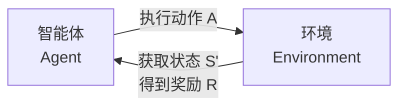

好的，这是一个关于强化学习的简单介绍，力求通俗易懂。

### 核心思想：像训宠物一样训练智能体

想象一下教一只小狗做新动作：

1.  你让它“坐下”。
2.  它尝试着坐下了。
3.  你给它一块零食作为**奖励**。
4.  它明白了“坐下”这个动作能带来好处，以后就更愿意坐下。

强化学习的核心思想与此非常相似：**一个智能体（Agent）通过与环境（Environment）进行交互，根据获得的奖励（Reward）来学习一系列动作（Action），以实现长期目标的最大化。**

---

### 一个简单的模型：五个关键要素

我们可以用下图来概括强化学习的核心交互过程：

这个循环中包含了五个最重要的要素：

1.  **智能体（Agent）**：学习者或决策者（比如上面的“小狗”，或者一个下棋的AI）。
2.  **环境（Environment）**：智能体所处的外部世界（比如“房间”，或者围棋棋盘）。
3.  **状态（State）**：环境在某个时刻的具体情况（比如小狗所在的位置，或者棋盘上所有棋子的布局）。
4.  **动作（Action）**：智能体可以做出的行为（比如“前进”、“后退”，或者“在某个位置落子”）。
5.  **奖励（Reward）**：环境对智能体动作的反馈信号，通常是一个数值（比如“吃到零食”是+10分，“撞到墙”是-5分）。

**学习的目标**：不是最大化眼前的一次性奖励，而是**最大化长期累积的总奖励**。

---

### 一个经典的例子：走迷宫

*   **智能体**：迷宫中的一个小机器人。
*   **环境**：迷宫本身。
*   **状态**：机器人当前所在的格子。
*   **动作**：向上、下、左、右移动。
*   **奖励**：
    *   走到出口：+100（巨大成功！）
    *   每走一步：-1（鼓励它尽快找到出口，而不是原地打转）
    *   撞墙：-5（告诉这这样做不好）

一开始，机器人完全不知道路，只会随机乱走。它可能会撞很多次墙，但偶尔会找到出口并获得巨大奖励。通过成千上万次的尝试，它慢慢地学习到：“哦，原来走那条路，虽然步骤多一点，但最终能拿到+100的奖励，扣掉步骤分，还是很划算。而走另一条路总是死胡同，要避免。”

---

### 主要特点

*   **试错学习**：通过不断的“尝试-错误-反馈”来学习，没有现成的答案。
*   **延迟奖励**：重要的奖励往往来得比较晚。比如下围棋，直到最后一步才知道输赢（奖励），但之前的每一步都至关重要。
*   **序列决策**：决策是一个连续的过程，当前的行动会影响未来的所有状态。

---

### 常见的算法分类

*   **基于价值**：学习“在某个状态下，哪个动作长期来看最有价值”，然后选择价值最高的动作。代表作：**Q-Learning, DQN**。
*   **基于策略**：直接学习一个“行为指南”，告诉智能体在什么状态下应该做什么动作。代表作：**Policy Gradients**。
*   **演员-评论家**：结合以上两者。“演员”负责执行动作（基于策略），“评论家”负责评价动作的好坏（基于价值），从而共同进步。代表作：**A2C, A3C**。

---

### 实际应用

强化学习在解决复杂的序列决策问题上非常强大，应用包括：

*   **游戏AI**：AlphaGo/AlphaZero（围棋）、OpenAI Five（Dota2）、DeepMind的AI在《星际争霸2》中达到宗师水平。
*   **机器人控制**：让机器人学习行走、抓取物体等复杂技能。
*   **自动驾驶**：学习如何安全、高效地驾驶汽车。
*   **推荐系统**：学习为用户推荐什么内容，以最大化用户的长期 engagement。
*   **金融交易**：学习何时买入/卖出以最大化投资回报。

### 总结

简单来说，强化学习就是：

> **让一个智能体在未知的环境中，通过不断试错，从结果中学习，最终学会完成特定任务的最佳策略。**

它被认为是实现通用人工智能的关键路径之一，因为它模拟了人类和动物从环境中学习的基本方式。