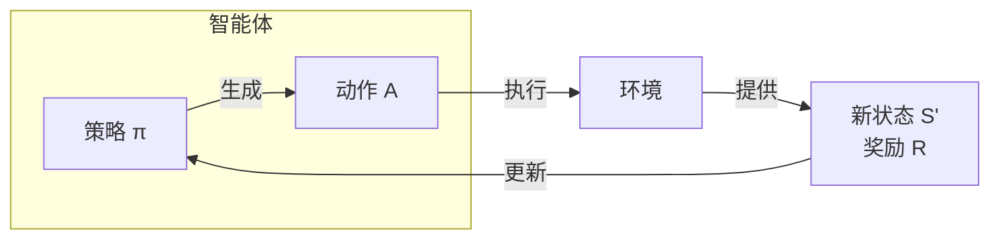

好的，我们来深入探讨强化学习中另一个基石般的概念——**策略**。

如果说**回报**是智能体学习的“指南针”（指明好坏），那么**策略**就是智能体的“大脑”或“行为指南”（决定怎么做）。

---

### 1. 核心定义：什么是策略？

**策略** 定义了智能体在特定环境状态下的行为方式。它回答了一个核心问题：**“我现在处于某种状态，我接下来应该做什么动作？”**

形式上，策略是一个从状态 `s` 到动作 `a` 的映射。它可以有两种表现形式：

1.  **确定性策略**
    *   **定义**：在给定状态下，策略**明确地指定一个**要执行的动作。
    *   **数学表示**： \( a = \mu(s) \)
    *   **例子**：像一条严格的规则。“在围棋的某个棋盘状态 `s` 下，永远在‘天元’位置落子。”

2.  **随机性策略**
    *   **定义**：在给定状态下，策略给出的是所有可能动作的**概率分布**。智能体根据这个概率分布来随机选择动作。
    *   **数学表示**： \( \pi(a|s) = P(A_t=a | S_t=s) \)
    *   **例子**：更像一个带有倾向性的建议。“在状态 `s` 下，有80%的概率选择‘前进’，20%的概率选择‘左转’。”

**为什么需要随机性策略？**
*   **探索**：在学习的早期，随机性可以保证智能体尝试各种不同的动作，从而发现哪些是好的。
*   **应对不确定性**：当环境本身不确定时，最优行为可能不是固定的。
*   **博弈论均衡**在像“石头剪刀布”这样的游戏中，确定性的策略会被对手利用，而随机均匀分布才是最优策略。

---

### 2. 策略的角色：智能体的核心

我们可以将策略置于强化学习的核心循环中来看它的作用：

策略是智能体的一部分，它接收来自环境的新状态和奖励，然后据此生成要执行的动作。整个学习过程的目标，就是**寻找一个最优策略**。

---

### 3. 什么是最优策略？

**最优策略**，记作 \( \pi^* \)，是那个能够最大化**长期累积回报**（即我们上一讲提到的**回报** \( G_t \)）的策略。

换句话说：
*   对于任何一个状态 `s`，遵循最优策略 \( \pi^* \) 所获得的预期回报，**大于或等于**遵循任何其他策略 \( \pi \) 所获得的回报。
*   一旦找到了 \( \pi^* \)，智能体的问题就解决了，它只需要在任何状态下简单地执行 \( \pi^* \) 推荐的动作，就能取得最好的结果。

**例子**：在象棋中，最优策略就是一个“不败秘籍”。对于任何一个棋盘局面，这个秘籍都能告诉你一步最佳的走法，只要你跟着走，最终结果（赢或和）就是你能达到的最好结果。

---

### 4. 策略是如何学习和改进的？

不同的强化学习算法，学习和改进策略的方式也不同。这主要分为三大类：

#### a) 基于价值的方法
*   **核心思想**：先学习**动作价值函数 Q(s, a)**，然后**间接地**导出策略。
*   **策略是如何产生的**：策略是“贪婪的”——在每个状态 `s`，总是选择那个能让 Q值 最大的动作。
    \( \pi(s) = \underset{a}{\operatorname{argmax}} Q(s, a) \)
*   **特点**：策略本身（选择最大Q值的动作）是固定的，改进策略是通过更新Q表/Q网络来实现的。
*   **代表作**：Q-Learning, DQN。

#### b) 基于策略的方法
*   **核心思想**：**直接**学习策略函数 \( \pi(a|s) \) 本身，而不需要依赖价值函数。
*   **策略是如何产生的**：策略通常由一个带参数的函数（如神经网络）表示。通过调整函数的参数，来改变在某个状态下选择某个动作的概率。
    *   如果一个动作能带来高回报，就增加它被选中的概率。
    *   如果一个动作导致低回报或惩罚，就减少它被选中的概率。
*   **特点**：直接、擅长处理连续动作空间、通常是随机性策略。
*   **代表作**：REINFORCE, 策略梯度。

#### c) 演员-评论家方法
*   **核心思想**：结合以上两者，取长补短。
*   **架构**：
    *   **演员**：负责执行策略 \( \pi(a|s) \)（基于策略的方法）。它决定“怎么做”。
    *   **评论家**：负责评价策略的好坏，它学习价值函数 \( V(s) \) 或 \( Q(s, a) \)（基于价值的方法）。它评价“做得怎么样”。
*   **工作流程**：
    1.  **演员** 在状态 `s` 根据当前策略做出一个动作 `a`。
    2.  环境反馈新的状态 `s'` 和奖励 `r`。
    3.  **评论家** 根据这个结果来计算一个**时序差分误差**，判断这个动作比预期好还是坏。
    4.  这个误差信号被同时用来：
        *   **更新评论家**：让它未来的评价更准确。
        *   **更新演员**：如果误差是正的，就调整策略以增加未来选择动作 `a` 的概率；反之则减少。
*   **比喻**：演员在演戏，评论家在看戏并写影评。演员根据评论家的影评来调整自己的演技。
*   **代表作**：A2C, A3C, DDPG, PPO。

---

### 总结

*   **策略**是智能体的决策核心，是从状态到动作的映射。
*   它可以是**确定性的**（一个确定动作）或**随机性的**（一个概率分布）。
*   强化学习的终极目标是找到**最优策略** \( \pi^* \)。
*   算法通过不同方式改进策略：
    *   **基于价值**：先学价值，再间接得到策略。
    *   **基于策略**：直接学习和优化策略函数。
    *   **演员-评论家**：结合两者，让一个“演员”和一個“评论家”共同进步。

理解策略的概念，是理解不同强化学习算法流派之间区别和联系的关键。